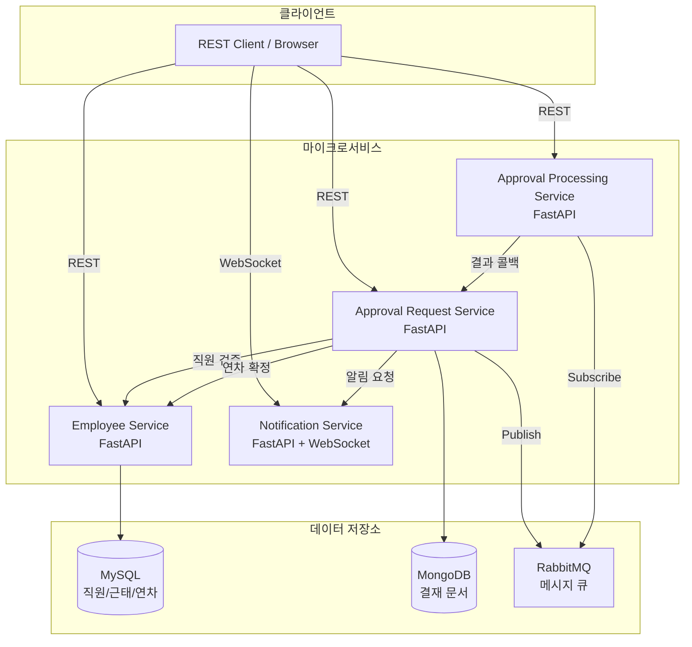

# ERP 마이크로서비스 시스템

FastAPI 기반의 마이크로서비스 아키텍처로 구현된 ERP(Enterprise Resource Planning) 시스템입니다.

## 📋 프로젝트 개요

본 프로젝트는 직원 관리, 근태 관리, 연차 관리, 결재 시스템을 제공하는 마이크로서비스 기반 ERP 시스템입니다.

### 주요 기능

- **직원 관리**: 직원 정보 CRUD
- **근태 관리**: 출퇴근 기록 및 조회
- **연차 관리**: 연차 신청, 승인, 사용 이력 관리
- **결재 시스템**: 다단계 결재 프로세스 (승인/반려)
- **실시간 알림**: WebSocket 기반 결재 알림

## 🏗️ 아키텍처



### 서비스 구성

| 서비스 | 역할 | 기술 스택 | 저장소 |
|-------|------|----------|--------|
| **Employee Service** | 직원/근태/연차 관리 | FastAPI + SQLAlchemy | MySQL |
| **Approval Request Service** | 결재 요청 관리 | FastAPI + Motor | MongoDB |
| **Approval Processing Service** | 결재 처리 | FastAPI + RabbitMQ | In-memory |
| **Notification Service** | 실시간 알림 | FastAPI + WebSocket | In-memory |

## 🚀 빠른 시작

### 사전 요구사항

- Docker Desktop
- Kubernetes (Docker Desktop 내장 또는 별도 클러스터)
- kubectl CLI

### 1. 저장소 클론

```bash
git clone <repository-url>
cd 32217755_ERP
```

### 2. Docker 이미지 빌드

```powershell
# Employee Service
docker build -t gkdltpa1/infra-employee-service:latest .\backend\employee-service

# Approval Request Service
docker build -t gkdltpa1/infra-approval-request-service:latest .\backend\approval-request-service

# Approval Processing Service
docker build -t gkdltpa1/infra-approval-processing-service:latest .\backend\approval-processing-service

# Notification Service
docker build -t gkdltpa1/infra-notification-service:latest .\backend\notification-service
```

### 3. Kubernetes 배포

```powershell
# 네임스페이스 생성
kubectl apply -f k8s\namespace.yaml

# 데이터베이스 및 메시지 브로커
kubectl apply -f k8s\mysql\
kubectl apply -f k8s\mongodb\
kubectl apply -f k8s\rabbitmq\

# 애플리케이션 서비스
kubectl apply -f k8s\employee-service\
kubectl apply -f k8s\approval-request-service\
kubectl apply -f k8s\approval-processing-service\
kubectl apply -f k8s\notification-service\
```

### 4. 포트 포워딩

각 터미널에서 실행:

```powershell
# 터미널 1
kubectl port-forward -n erp svc/employee-service 8001:8000

# 터미널 2
kubectl port-forward -n erp svc/approval-request-service 8002:8000

# 터미널 3
kubectl port-forward -n erp svc/approval-processing-service 8003:8000

# 터미널 4
kubectl port-forward -n erp svc/notification-service 8004:8000
```

### 5. API 접근

- **Employee Service**: http://localhost:8001/docs
- **Approval Request Service**: http://localhost:8002/docs
- **Approval Processing Service**: http://localhost:8003/docs
- **Notification Service**: http://localhost:8004/docs

## 📚 문서

자세한 내용은 `docs/` 폴더의 문서를 참조하세요:

- **[아키텍처 설계](docs/architecture.md)**: 시스템 구조, 데이터 흐름, 배포 구성
- **[API 설계](docs/api-design.md)**: 모든 REST API 엔드포인트 명세
- **[빌드 및 실행](docs/run-and-build.md)**: 상세한 빌드, 배포, 설정 가이드
- **[문제 해결](docs/troubleshooting.md)**: 개발 중 발생한 문제와 해결 방법

## 🧪 테스트 시나리오

### 기본 결재 플로우

```bash
# 1. 직원 생성
curl -X POST http://localhost:8001/employees \
  -H "Content-Type: application/json" \
  -d '{"name":"홍길동","department":"개발팀","position":"시니어"}'

# 2. 결재 요청 생성
curl -X POST http://localhost:8002/approvals \
  -H "Content-Type: application/json" \
  -d '{
    "requesterId": 1,
    "title": "비용 지출 결재",
    "content": "출장비",
    "steps": [
      {"step": 1, "approverId": 2},
      {"step": 2, "approverId": 3}
    ],
    "requestType": "GENERAL"
  }'

# 3. 결재자 1 승인
curl -X POST http://localhost:8003/process/2/1 \
  -H "Content-Type: application/json" \
  -d '{"action":"approve"}'

# 4. 결재자 2 승인
curl -X POST http://localhost:8003/process/3/1 \
  -H "Content-Type: application/json" \
  -d '{"action":"approve"}'

# 5. 결재 상태 확인
curl http://localhost:8002/approvals/1
```

### 연차 결재 + 확정 플로우

```bash
# 1. 연차 결재 요청
curl -X POST http://localhost:8002/approvals \
  -H "Content-Type: application/json" \
  -d '{
    "requesterId": 1,
    "title": "연차 신청 (12/1~12/2)",
    "content": "연말 여행",
    "steps": [
      {"step": 1, "approverId": 2},
      {"step": 2, "approverId": 3}
    ],
    "requestType": "LEAVE",
    "leaveInfo": {
      "startDate": "2025-12-01",
      "endDate": "2025-12-02",
      "days": 2,
      "leaveType": "annual",
      "reason": "연말 여행"
    }
  }'

# 2. 결재자 1, 2 순차 승인 (위와 동일)

# 3. 연차 확정 확인
curl http://localhost:8001/leaves/me?employeeId=1
```

### 근태 관리 플로우

```bash
# 1. 출근
curl -X POST http://localhost:8001/attendance/check-in \
  -H "Content-Type: application/json" \
  -d '{"employee_id":1}'

# 2. 퇴근
curl -X POST http://localhost:8001/attendance/check-out \
  -H "Content-Type: application/json" \
  -d '{"employee_id":1}'

# 3. 근태 이력 조회
curl "http://localhost:8001/attendance/me?employeeId=1&from=2025-11-01&to=2025-11-30"
```

## 🛠️ 기술 스택

### Backend
- **Framework**: FastAPI
- **Language**: Python 3.12
- **Async**: asyncio, aiohttp
- **ORM**: SQLAlchemy 2.x (async)
- **ODM**: Motor (MongoDB async driver)
- **Message Queue**: RabbitMQ (aio-pika)
- **WebSocket**: FastAPI native WebSocket

### Database
- **MySQL 8**: 직원, 근태, 연차 데이터
- **MongoDB**: 결재 문서 및 이력

### Infrastructure
- **Container**: Docker
- **Orchestration**: Kubernetes
- **API Documentation**: OpenAPI/Swagger

## 📊 데이터 모델

### MySQL (Employee Service)

#### employees
```sql
CREATE TABLE employees (
  id BIGINT PRIMARY KEY AUTO_INCREMENT,
  name VARCHAR(100) NOT NULL,
  department VARCHAR(100) NOT NULL,
  position VARCHAR(100) NOT NULL,
  created_at DATETIME DEFAULT CURRENT_TIMESTAMP
);
```

#### attendance_records
```sql
CREATE TABLE attendance_records (
  id BIGINT PRIMARY KEY AUTO_INCREMENT,
  employee_id BIGINT NOT NULL,
  attendance_date DATE NOT NULL,
  check_in DATETIME NOT NULL,
  check_out DATETIME NULL,
  work_minutes INT NULL,
  created_at DATETIME DEFAULT CURRENT_TIMESTAMP,
  FOREIGN KEY (employee_id) REFERENCES employees(id)
);
```

#### leave_records
```sql
CREATE TABLE leave_records (
  id BIGINT PRIMARY KEY AUTO_INCREMENT,
  employee_id BIGINT NOT NULL,
  start_date DATE NOT NULL,
  end_date DATE NOT NULL,
  days INT NOT NULL,
  leave_type VARCHAR(20) NOT NULL,
  status VARCHAR(20) NOT NULL,
  reason VARCHAR(255) NULL,
  created_at DATETIME DEFAULT CURRENT_TIMESTAMP,
  FOREIGN KEY (employee_id) REFERENCES employees(id)
);
```

### MongoDB (Approval Request Service)

#### approvals (Collection)
```json
{
  "requestId": 1,
  "requesterId": 1,
  "title": "비용 지출 결재",
  "content": "출장비 정산",
  "steps": [
    {
      "step": 1,
      "approverId": 2,
      "status": "approved",
      "updatedAt": "2025-11-29T10:30:00"
    },
    {
      "step": 2,
      "approverId": 3,
      "status": "pending",
      "updatedAt": null
    }
  ],
  "finalStatus": "in_progress",
  "requestType": "GENERAL",
  "leaveInfo": null,
  "createdAt": "2025-11-29T10:00:00",
  "updatedAt": "2025-11-29T10:30:00"
}
```

## 🔄 서비스 간 통신

### 동기 통신 (REST)
- Approval Request → Employee Service: 직원 존재 확인
- Approval Processing → Approval Request: 결재 결과 콜백
- Approval Request → Employee Service: 연차 확정 요청
- Approval Request → Notification: 알림 전송 요청

### 비동기 통신 (RabbitMQ)
- Approval Request → Approval Processing: 결재 작업 전달
- Queue: `approval.work`

### 실시간 통신 (WebSocket)
- Notification Service → Client: 결재 알림 푸시
- Endpoint: `ws://localhost:8004/ws/{employeeId}`

## 🐛 문제 해결

주요 문제와 해결 방법:

### 1. MySQL 인증 에러
```
RuntimeError: 'cryptography' package is required
```
**해결**: `requirements.txt`에 `cryptography` 추가

### 2. MongoDB date 직렬화 에러
```
bson.errors.InvalidDocument: cannot encode object: datetime.date
```
**해결**: `jsonable_encoder` + date → ISO 문자열 변환 로직 추가

### 3. FastAPI local_kw 쿼리 파라미터 버그
```
{"loc": ["query", "local_kw"], "msg": "Field required"}
```
**해결**: `Depends(sessionmaker)` 대신 `get_db()` 함수 사용

자세한 내용은 [troubleshooting.md](docs/troubleshooting.md)를 참조하세요.

## 📁 프로젝트 구조

```
32217755_ERP/
├── backend/
│   ├── employee-service/          # 직원/근태/연차 서비스
│   ├── approval-request-service/  # 결재 요청 서비스
│   ├── approval-processing-service/ # 결재 처리 서비스
│   └── notification-service/      # 알림 서비스
├── docs/                          # 문서
│   ├── architecture.md
│   ├── api-design.md
│   ├── run-and-build.md
│   └── troubleshooting.md
├── k8s/                          # Kubernetes 매니페스트
│   ├── namespace.yaml
│   ├── employee-service/
│   ├── approval-request-service/
│   ├── approval-processing-service/
│   ├── notification-service/
│   ├── mysql/
│   ├── mongodb/
│   └── rabbitmq/
├── infra/
│   └── docker-compose.yml        # 로컬 개발용 (선택)
├── proto/
│   └── approval.proto            # gRPC 스키마 (레거시)
├── scripts/
│   └── init_mysql.sql            # MySQL 초기화 스크립트
└── README.md
```

## 🚧 향후 개선 사항

- [ ] JWT 인증/인가 추가
- [ ] API Gateway 도입 (rate limiting, routing)
- [ ] Prometheus + Grafana 모니터링
- [ ] ELK Stack 로깅 시스템
- [ ] CI/CD 파이프라인 구축
- [ ] 단위 테스트 및 통합 테스트 추가
- [ ] Horizontal Pod Autoscaling 설정
- [ ] TLS/SSL 적용

## 📝 라이선스

This project is for educational purposes.

## 👥 개발자

- **학번**: 32217755
- **과목**: 클라우드 컴퓨팅 및 분산 시스템

## 📞 문의

문제가 발생하거나 질문이 있으시면 Issues를 통해 문의해 주세요.

---

**⭐ 이 프로젝트가 도움이 되셨다면 Star를 눌러주세요!**
