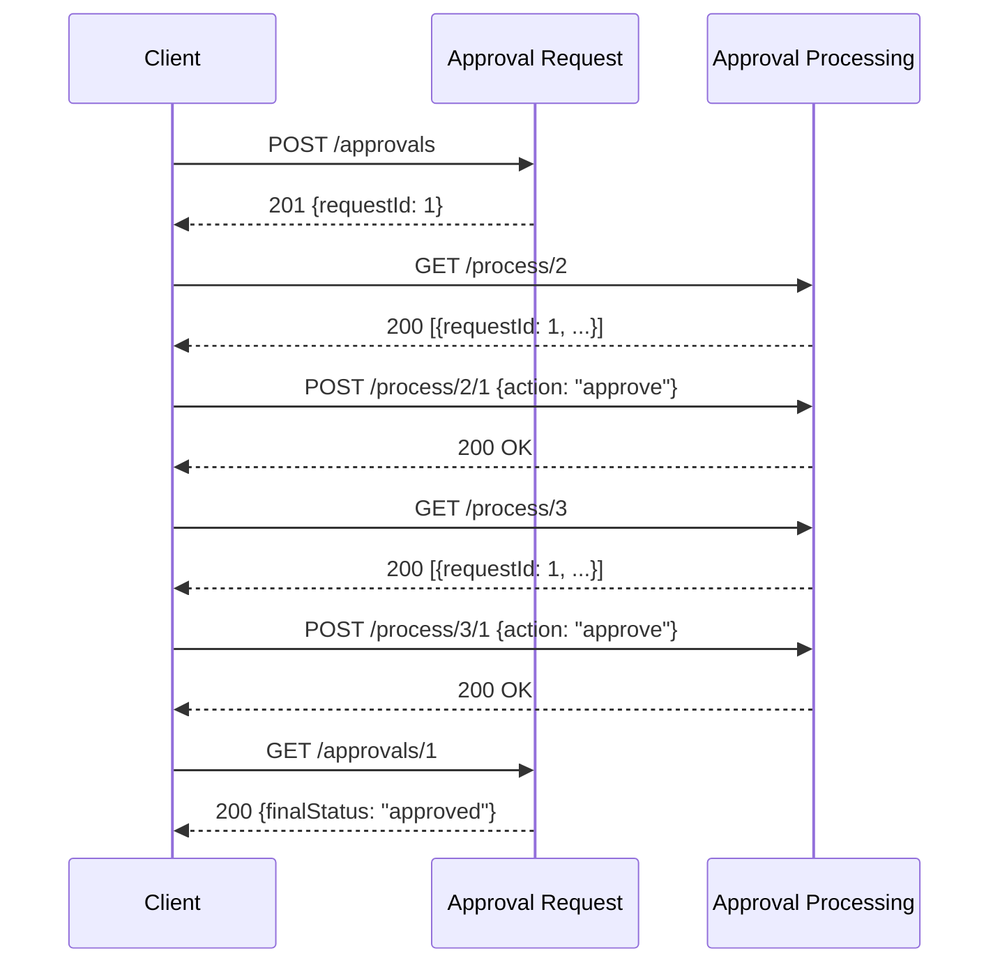

# API 설계 문서

## 1. API 개요

본 문서는 ERP 마이크로서비스 시스템의 모든 REST API 엔드포인트를 정리합니다.

### 1.1 공통 사항

- **Content-Type**: `application/json`
- **포트 (로컬 포트포워딩)**:
  - Employee Service: `8001`
  - Approval Request Service: `8002`
  - Approval Processing Service: `8003`
  - Notification Service: `8004`

## 2. Employee Service API

### 2.1 직원 관리

#### 직원 생성
```http
POST /employees
Content-Type: application/json

{
  "name": "홍길동",
  "department": "개발팀",
  "position": "시니어 개발자"
}
```

**Response (201 Created)**:
```json
{
  "id": 1,
  "name": "홍길동",
  "department": "개발팀",
  "position": "시니어 개발자",
  "created_at": "2025-11-29T10:00:00"
}
```

#### 직원 목록 조회
```http
GET /employees
```

**Response (200 OK)**:
```json
[
  {
    "id": 1,
    "name": "홍길동",
    "department": "개발팀",
    "position": "시니어 개발자",
    "created_at": "2025-11-29T10:00:00"
  }
]
```

#### 직원 단건 조회
```http
GET /employees/{employee_id}
```

**Response (200 OK)**:
```json
{
  "id": 1,
  "name": "홍길동",
  "department": "개발팀",
  "position": "시니어 개발자",
  "created_at": "2025-11-29T10:00:00"
}
```

**Response (404 Not Found)**:
```json
{
  "detail": "Employee not found"
}
```

### 2.2 근태 관리 API

#### 출근 처리
```http
POST /attendance/check-in
Content-Type: application/json

{
  "employee_id": 1
}
```

**Response (200 OK)**:
```json
{
  "id": 1,
  "employee_id": 1,
  "attendance_date": "2025-11-29",
  "check_in": "2025-11-29T09:00:00",
  "check_out": null,
  "work_minutes": null,
  "created_at": "2025-11-29T09:00:00"
}
```

**Response (400 Bad Request)** - 이미 출근한 경우:
```json
{
  "detail": "Already checked in today"
}
```

**Response (400 Bad Request)** - 직원이 존재하지 않는 경우:
```json
{
  "detail": "Employee not found"
}
```

#### 퇴근 처리
```http
POST /attendance/check-out
Content-Type: application/json

{
  "employee_id": 1
}
```

**Response (200 OK)**:
```json
{
  "id": 1,
  "employee_id": 1,
  "attendance_date": "2025-11-29",
  "check_in": "2025-11-29T09:00:00",
  "check_out": "2025-11-29T18:00:00",
  "work_minutes": 540,
  "created_at": "2025-11-29T09:00:00"
}
```

**Response (400 Bad Request)** - 출근 기록이 없는 경우:
```json
{
  "detail": "No active check-in record found for today"
}
```

#### 근태 이력 조회
```http
GET /attendance/me?employeeId=1&from=2025-11-01&to=2025-11-30
```

**Query Parameters**:
- `employeeId` (required): 직원 ID
- `from` (required): 시작일 (YYYY-MM-DD)
- `to` (required): 종료일 (YYYY-MM-DD)

**Response (200 OK)**:
```json
[
  {
    "id": 1,
    "employee_id": 1,
    "attendance_date": "2025-11-29",
    "check_in": "2025-11-29T09:00:00",
    "check_out": "2025-11-29T18:00:00",
    "work_minutes": 540,
    "created_at": "2025-11-29T09:00:00"
  }
]
```

### 2.3 연차 관리 API

#### 연차 이력 조회
```http
GET /leaves/me?employeeId=1
```

**Query Parameters**:
- `employeeId` (required): 직원 ID

**Response (200 OK)**:
```json
[
  {
    "id": 1,
    "employee_id": 1,
    "start_date": "2025-12-01",
    "end_date": "2025-12-02",
    "days": 2,
    "leave_type": "annual",
    "status": "approved",
    "reason": "연말 여행",
    "created_at": "2025-11-29T10:00:00"
  }
]
```

#### 연차 확정 (내부 API)
```http
POST /leaves/internal/approved
Content-Type: application/json

{
  "employeeId": 1,
  "startDate": "2025-12-01",
  "endDate": "2025-12-02",
  "days": 2,
  "leaveType": "annual",
  "reason": "연말 여행",
  "requestId": 4
}
```

> ⚠️ **주의**: 이 API는 Approval Request Service에서만 호출하는 내부 전용 API입니다.

**Response (200 OK)**:
```json
{
  "id": 1,
  "employee_id": 1,
  "start_date": "2025-12-01",
  "end_date": "2025-12-02",
  "days": 2,
  "leave_type": "annual",
  "status": "approved",
  "reason": "연말 여행",
  "created_at": "2025-11-29T10:00:00"
}
```

### 2.4 헬스 체크
```http
GET /health
```

**Response (200 OK)**:
```json
{
  "status": "healthy"
}
```

## 3. Approval Request Service API

### 3.1 결재 요청 관리

#### 결재 요청 생성 (일반)
```http
POST /approvals
Content-Type: application/json

{
  "requesterId": 1,
  "title": "비용 지출 결재",
  "content": "출장비 정산",
  "steps": [
    { "step": 1, "approverId": 2 },
    { "step": 2, "approverId": 3 }
  ],
  "requestType": "GENERAL"
}
```

**Response (201 Created)**:
```json
{
  "requestId": 1
}
```

#### 결재 요청 생성 (연차)
```http
POST /approvals
Content-Type: application/json

{
  "requesterId": 1,
  "title": "연차 신청 (12/1~12/2)",
  "content": "연말 여행",
  "steps": [
    { "step": 1, "approverId": 2 },
    { "step": 2, "approverId": 3 }
  ],
  "requestType": "LEAVE",
  "leaveInfo": {
    "startDate": "2025-12-01",
    "endDate": "2025-12-02",
    "days": 2,
    "leaveType": "annual",
    "reason": "연말 여행"
  }
}
```

**Response (201 Created)**:
```json
{
  "requestId": 4
}
```

**Response (400 Bad Request)** - 직원이 존재하지 않는 경우:
```json
{
  "detail": "Employee 999 not found in Employee Service"
}
```

**Response (400 Bad Request)** - 연차 타입인데 leaveInfo 없는 경우:
```json
{
  "detail": "leaveInfo is required when requestType is LEAVE"
}
```

**Response (400 Bad Request)** - steps 검증 실패:
```json
{
  "detail": "steps must start at 1 and be consecutive in ascending order"
}
```

#### 결재 요청 목록 조회
```http
GET /approvals
```

**Response (200 OK)**:
```json
[
  {
    "requestId": 1,
    "requesterId": 1,
    "title": "비용 지출 결재",
    "content": "출장비 정산",
    "steps": [
      {
        "step": 1,
        "approverId": 2,
        "status": "approved",
        "updatedAt": "2025-11-29T10:30:00"
      },
      {
        "step": 2,
        "approverId": 3,
        "status": "pending",
        "updatedAt": null
      }
    ],
    "finalStatus": "in_progress",
    "requestType": "GENERAL",
    "leaveInfo": null,
    "createdAt": "2025-11-29T10:00:00",
    "updatedAt": "2025-11-29T10:30:00"
  }
]
```

#### 결재 요청 상세 조회
```http
GET /approvals/{request_id}
```

**Response (200 OK)**:
```json
{
  "requestId": 4,
  "requesterId": 1,
  "title": "연차 신청 (12/1~12/2)",
  "content": "연말 여행",
  "steps": [
    {
      "step": 1,
      "approverId": 2,
      "status": "approved",
      "updatedAt": "2025-11-29T10:30:00"
    },
    {
      "step": 2,
      "approverId": 3,
      "status": "approved",
      "updatedAt": "2025-11-29T10:35:00"
    }
  ],
  "finalStatus": "approved",
  "requestType": "LEAVE",
  "leaveInfo": {
    "startDate": "2025-12-01",
    "endDate": "2025-12-02",
    "days": 2,
    "leaveType": "annual",
    "reason": "연말 여행"
  },
  "createdAt": "2025-11-29T10:00:00",
  "updatedAt": "2025-11-29T10:35:00"
}
```

**Response (404 Not Found)**:
```json
{
  "detail": "Approval request not found"
}
```

### 3.2 결재 결과 콜백 (내부 API)

```http
POST /approvals/internal/result
Content-Type: application/json

{
  "requestId": 1,
  "step": 1,
  "approverId": 2,
  "status": "approved"
}
```

> ⚠️ **주의**: 이 API는 Approval Processing Service에서만 호출하는 내부 전용 API입니다.

**Response (204 No Content)**: 성공 시 바디 없음

**Response (404 Not Found)**:
```json
{
  "detail": "Approval request not found"
}
```

**Response (400 Bad Request)** - step/approverId 미스매치:
```json
{
  "detail": "Matching approval step not found"
}
```

### 3.3 헬스 체크
```http
GET /health
```

**Response (200 OK)**:
```json
{
  "status": "healthy"
}
```

## 4. Approval Processing Service API

### 4.1 결재 처리

#### 결재자별 대기 목록 조회
```http
GET /process/{approver_id}
```

**Response (200 OK)**:
```json
[
  {
    "requestId": 1,
    "requesterId": 1,
    "title": "비용 지출 결재",
    "content": "출장비 정산",
    "currentStep": 2,
    "approverId": 3
  }
]
```

**Response (200 OK)** - 대기 건 없음:
```json
[]
```

#### 결재 승인/반려 처리
```http
POST /process/{approver_id}/{request_id}
Content-Type: application/json

{
  "action": "approve"
}
```

**Request Body**:
- `action`: `"approve"` 또는 `"reject"`

**Response (200 OK)**:
```json
{
  "message": "Approval processed successfully",
  "requestId": 1,
  "approverId": 2,
  "action": "approve"
}
```

**Response (404 Not Found)** - 해당 결재 건이 큐에 없음:
```json
{
  "detail": "No pending approval found for this approver"
}
```

**Response (400 Bad Request)** - 잘못된 action 값:
```json
{
  "detail": "Invalid action. Must be 'approve' or 'reject'"
}
```

### 4.2 헬스 체크
```http
GET /health
```

**Response (200 OK)**:
```json
{
  "status": "healthy"
}
```

## 5. Notification Service API

### 5.1 알림 전송 (REST)

#### 알림 전송
```http
POST /notify
Content-Type: application/json

{
  "employeeId": 1,
  "type": "approval_result",
  "requestId": 4,
  "step": 2,
  "approverId": 3,
  "finalStatus": "approved",
  "stepStatus": "approved",
  "title": "연차 신청 (12/1~12/2)"
}
```

**Response (202 Accepted)**:
```json
{
  "delivered": true
}
```

> ℹ️ **참고**: 실제 메시지는 WebSocket으로 연결된 클라이언트에게 전달됩니다.

### 5.2 WebSocket 연결

#### WebSocket 엔드포인트
```
ws://localhost:8004/ws/{employee_id}
```

**연결 예시 (JavaScript)**:
```javascript
const ws = new WebSocket('ws://localhost:8004/ws/1');

ws.onopen = () => {
  console.log('WebSocket connected');
};

ws.onmessage = (event) => {
  const notification = JSON.parse(event.data);
  console.log('Notification received:', notification);
};

ws.onclose = () => {
  console.log('WebSocket disconnected');
};
```

**수신 메시지 예시**:
```json
{
  "employeeId": 1,
  "type": "approval_result",
  "requestId": 4,
  "step": 2,
  "approverId": 3,
  "finalStatus": "approved",
  "stepStatus": "approved",
  "title": "연차 신청 (12/1~12/2)"
}
```

### 5.3 헬스 체크
```http
GET /health
```

**Response (200 OK)**:
```json
{
  "status": "healthy"
}
```

## 6. API 호출 시나리오

### 6.1 기본 결재 승인 플로우



### 6.2 연차 결재 + 확정 플로우

```bash
# 1. 연차 결재 요청 생성
curl -X POST http://localhost:8002/approvals \
  -H "Content-Type: application/json" \
  -d '{
    "requesterId": 1,
    "title": "연차 신청 (12/1~12/2)",
    "content": "연말 여행",
    "steps": [
      {"step": 1, "approverId": 2},
      {"step": 2, "approverId": 3}
    ],
    "requestType": "LEAVE",
    "leaveInfo": {
      "startDate": "2025-12-01",
      "endDate": "2025-12-02",
      "days": 2,
      "leaveType": "annual",
      "reason": "연말 여행"
    }
  }'

# 2. 결재자 1 승인
curl -X POST http://localhost:8003/process/2/4 \
  -H "Content-Type: application/json" \
  -d '{"action": "approve"}'

# 3. 결재자 2 승인 (최종 승인)
curl -X POST http://localhost:8003/process/3/4 \
  -H "Content-Type: application/json" \
  -d '{"action": "approve"}'

# 4. 연차 확정 확인
curl http://localhost:8001/leaves/me?employeeId=1

# 5. 결재 상태 확인
curl http://localhost:8002/approvals/4
```

## 7. 에러 코드 정리

| HTTP 코드 | 의미 | 주요 발생 상황 |
|----------|------|--------------|
| 200 OK | 성공 | 조회, 처리 성공 |
| 201 Created | 생성 성공 | 직원, 결재 요청 생성 |
| 202 Accepted | 수락됨 | 알림 전송 수락 |
| 204 No Content | 성공 (응답 바디 없음) | 내부 콜백 성공 |
| 400 Bad Request | 잘못된 요청 | 유효성 검증 실패, 이미 출근, 직원 없음 |
| 404 Not Found | 리소스 없음 | 직원, 결재 건, 대기 건 없음 |
| 422 Unprocessable Entity | 처리 불가 | 스키마 검증 실패 |
| 500 Internal Server Error | 서버 오류 | DB 연결 실패, 예외 발생 |
| 502 Bad Gateway | 게이트웨이 오류 | 다른 서비스 호출 실패 |

## 8. API 테스트 도구

### 8.1 Swagger UI

각 서비스는 자체 Swagger UI를 제공합니다:

- Employee Service: http://localhost:8001/docs
- Approval Request Service: http://localhost:8002/docs
- Approval Processing Service: http://localhost:8003/docs
- Notification Service: http://localhost:8004/docs

### 8.2 cURL 예시 모음

```bash
# 직원 생성
curl -X POST http://localhost:8001/employees \
  -H "Content-Type: application/json" \
  -d '{"name":"홍길동","department":"개발팀","position":"시니어"}'

# 출근
curl -X POST http://localhost:8001/attendance/check-in \
  -H "Content-Type: application/json" \
  -d '{"employee_id":1}'

# 퇴근
curl -X POST http://localhost:8001/attendance/check-out \
  -H "Content-Type: application/json" \
  -d '{"employee_id":1}'

# 결재 요청
curl -X POST http://localhost:8002/approvals \
  -H "Content-Type: application/json" \
  -d '{"requesterId":1,"title":"테스트","content":"테스트","steps":[{"step":1,"approverId":2}],"requestType":"GENERAL"}'

# 결재 처리
curl -X POST http://localhost:8003/process/2/1 \
  -H "Content-Type: application/json" \
  -d '{"action":"approve"}'
```
