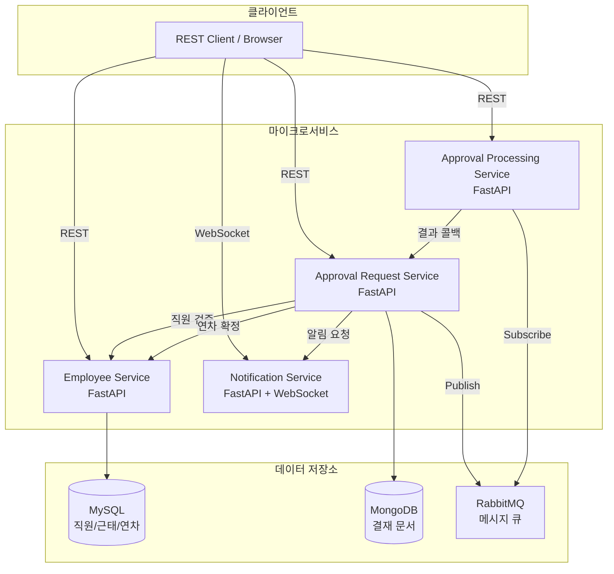
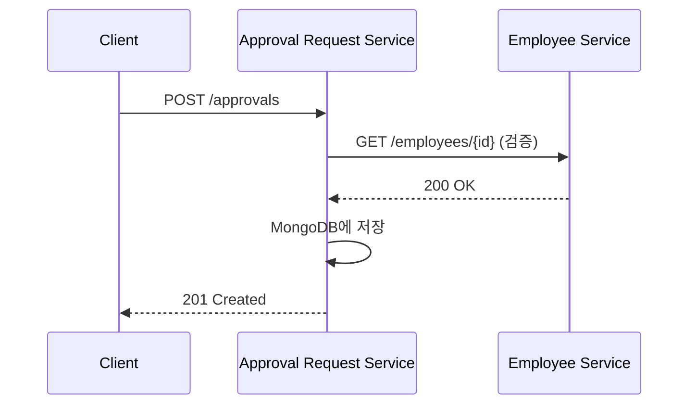
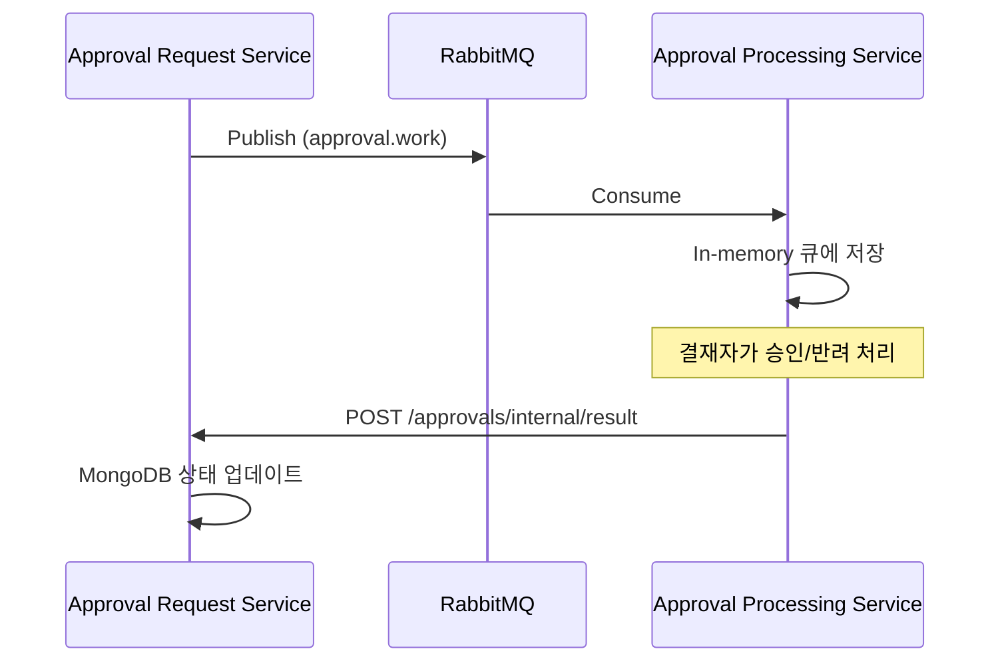
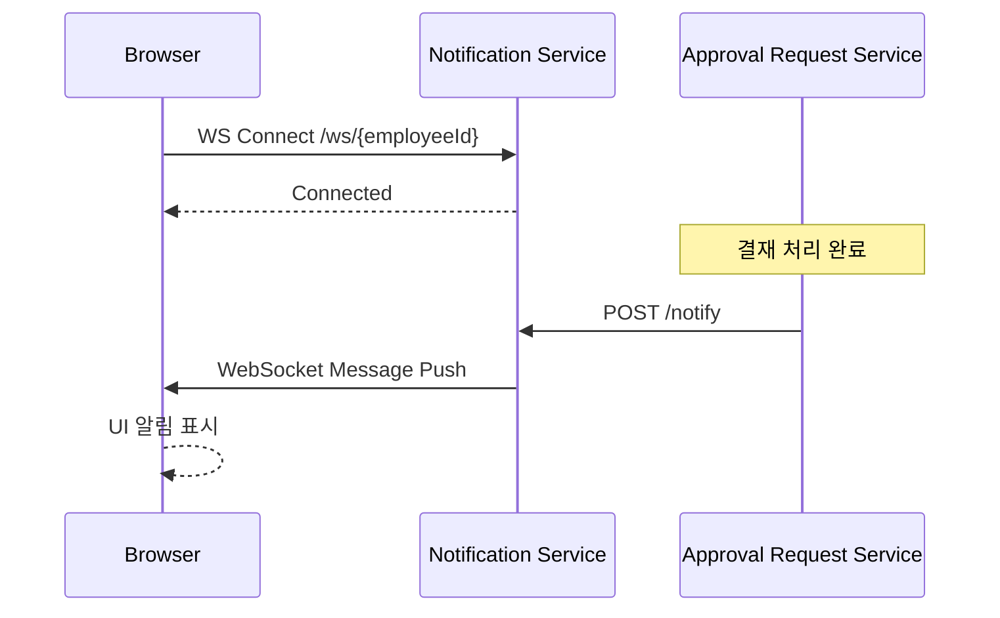
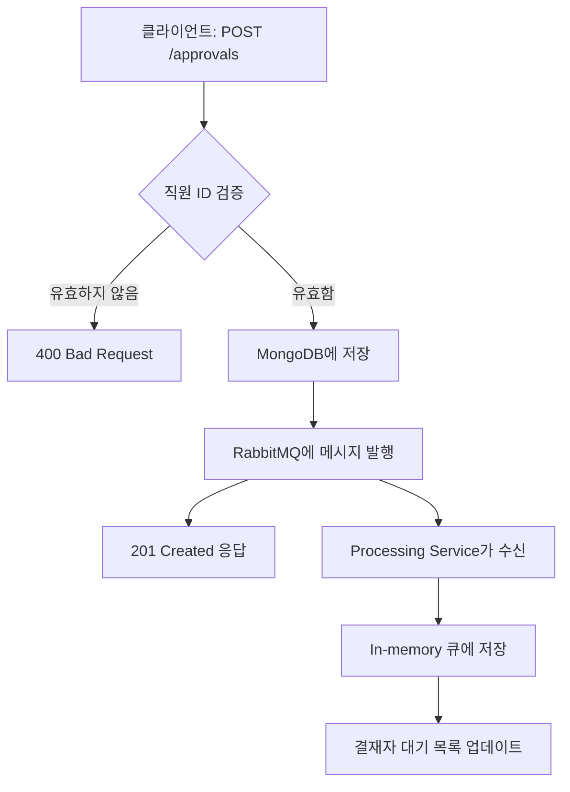
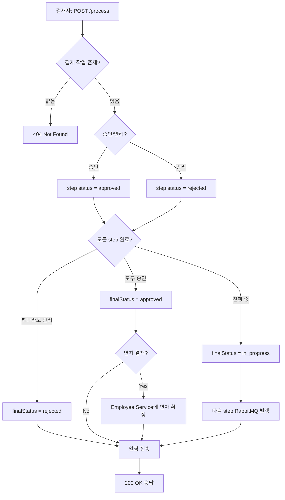
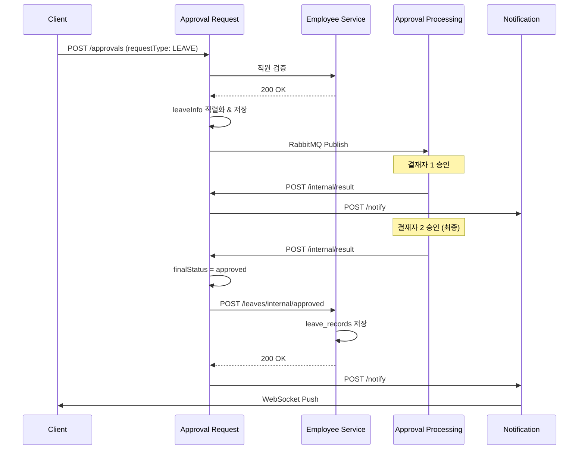
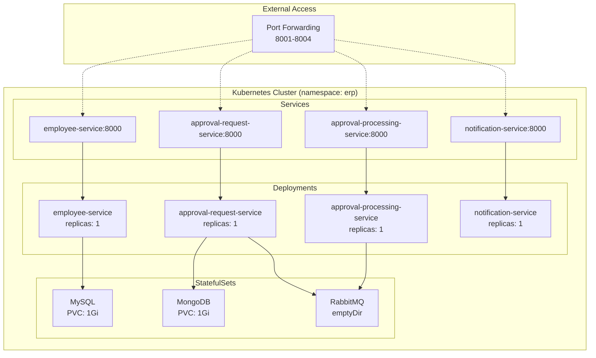

# 시스템 아키텍처

## 1. 전체 아키텍처 개요

본 프로젝트는 FastAPI + Python 기반의 마이크로서비스 아키텍처로 구성된 ERP 시스템입니다.

### 1.1 마이크로서비스 구성



### 1.2 서비스별 역할

#### Employee Service
- **역할**: 직원 정보의 단일 진실 공급원(Source of Truth)
- **기능**:
  - 직원 CRUD
  - 근태(출퇴근) 기록 관리
  - 연차(Leave) 기록 관리
- **저장소**: MySQL (erp 데이터베이스)
  - `employees` - 직원 정보
  - `attendance_records` - 근태 기록
  - `leave_records` - 연차 기록

#### Approval Request Service
- **역할**: 결재 요청 관리 및 조정
- **기능**:
  - 결재 요청 생성 및 조회
  - 직원 정보 검증 (Employee Service 호출)
  - RabbitMQ를 통한 결재 작업 전달
  - 결재 결과 수신 및 상태 업데이트
  - WebSocket 알림 트리거
  - 연차 결재 승인 시 Employee Service에 확정 요청
- **저장소**: MongoDB
  - Database: `erp`
  - Collection: `approvals`

#### Approval Processing Service
- **역할**: 결재 처리 전용 서비스
- **기능**:
  - RabbitMQ Consumer로 결재 작업 수신
  - In-memory 큐에 결재자별 작업 관리
  - 결재 승인/반려 처리
  - Approval Request Service로 결과 콜백
- **저장소**: In-memory (Python deque)

#### Notification Service
- **역할**: 실시간 알림 전송
- **기능**:
  - WebSocket 기반 실시간 푸시 알림
  - 직원별 WebSocket 연결 관리
  - REST API를 통한 알림 수신 및 브로드캐스트
- **저장소**: In-memory (ConnectionManager)

### 1.3 기술 스택

| 구성 요소 | 기술 |
|---------|------|
| 프레임워크 | FastAPI |
| 언어 | Python 3.12 |
| 비동기 처리 | asyncio, aiohttp |
| 데이터베이스 (관계형) | MySQL 8 |
| 데이터베이스 (문서형) | MongoDB |
| 메시지 브로커 | RabbitMQ |
| ORM | SQLAlchemy 2.x (async) |
| ODM | Motor (MongoDB async) |
| 메시징 라이브러리 | aio-pika |
| 컨테이너 | Docker |
| 오케스트레이션 | Kubernetes |
| API 문서 | OpenAPI/Swagger |

## 2. 통신 패턴

### 2.1 동기 통신 (REST)



**사용 케이스**:
- 직원 정보 조회/생성
- 결재 요청 생성
- 결재 상태 조회
- 근태/연차 기록 조회

### 2.2 비동기 통신 (RabbitMQ)



**사용 케이스**:
- 결재 요청 비동기 처리
- 결재자별 작업 큐 관리
- 다단계 결재 플로우

### 2.3 실시간 통신 (WebSocket)



**사용 케이스**:
- 결재 승인/반려 실시간 알림
- 결재 요청 생성 알림
- 연차 확정 알림

## 3. 데이터 흐름

### 3.1 결재 요청 생성 플로우



### 3.2 결재 처리 플로우



### 3.3 연차 결재 특수 플로우



## 4. 배포 아키텍처

### 4.1 Kubernetes 구성



### 4.2 컨테이너 이미지 구조

각 서비스는 다음 구조로 Docker 이미지화됩니다:

```
FROM python:3.12-slim
WORKDIR /app
COPY requirements.txt .
RUN pip install --no-cache-dir -r requirements.txt
COPY app /app/app
CMD ["uvicorn", "app.main:app", "--host", "0.0.0.0", "--port", "8000"]
```

**이미지 이름**:
- `gkdltpa1/infra-employee-service:latest`
- `gkdltpa1/infra-approval-request-service:latest`
- `gkdltpa1/infra-approval-processing-service:latest`
- `gkdltpa1/infra-notification-service:latest`

## 5. 확장성 고려사항

### 5.1 수평 확장

- **Employee Service**: 여러 레플리카 배포 가능 (MySQL 연결 풀 관리)
- **Approval Request Service**: 레플리카 증가 시 MongoDB 연결 관리 필요
- **Approval Processing Service**: RabbitMQ Consumer 그룹으로 작동, 레플리카당 별도 큐 소비
- **Notification Service**: WebSocket 세션 관리를 위한 Redis 등 외부 세션 저장소 필요

### 5.2 성능 최적화

- **비동기 처리**: 모든 I/O는 asyncio 기반으로 처리
- **연결 풀링**: MySQL, MongoDB 커넥션 풀 사용
- **메시지 큐**: RabbitMQ를 통한 부하 분산 및 비동기 처리
- **In-memory 캐싱**: 결재 작업 큐를 메모리에서 관리하여 DB 부하 감소

### 5.3 장애 격리

- **서비스 독립성**: 각 서비스는 독립적으로 배포 및 재시작 가능
- **메시지 큐**: RabbitMQ 장애 시 재연결 로직 포함
- **데이터베이스**: MySQL/MongoDB 장애 시 서비스별 영향 최소화
- **헬스 체크**: 각 서비스에 `/health` 엔드포인트 제공

## 6. 보안 고려사항 (향후 개선)

현재 구현은 학습/과제 목적이므로 기본적인 보안만 적용되어 있습니다.
프로덕션 환경에서는 다음 항목들이 추가되어야 합니다:

- **인증/인가**: JWT 토큰 기반 인증
- **API Gateway**: 단일 진입점 및 rate limiting
- **TLS/SSL**: HTTPS 통신
- **Secret 관리**: Kubernetes Secret을 통한 민감 정보 관리
- **네트워크 정책**: Kubernetes NetworkPolicy를 통한 서비스 간 통신 제한
